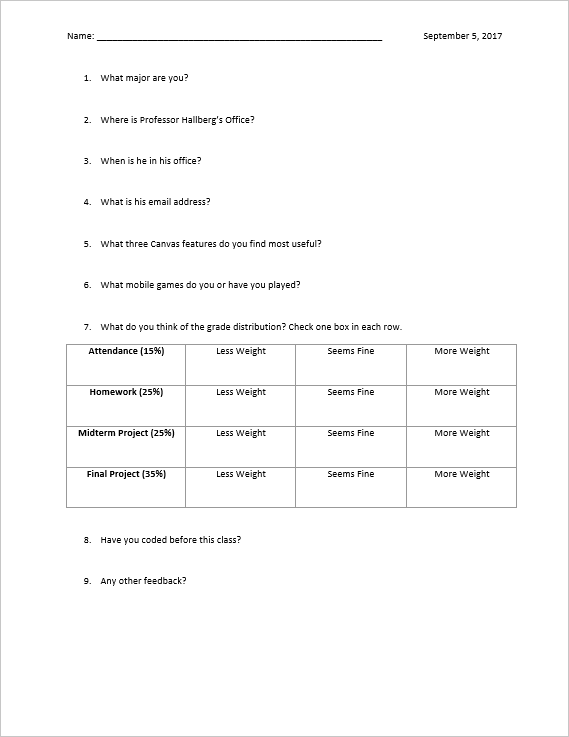

# 0 Intro to Class

## 0.0 About Me

My name is **Chris Hallberg**.

I am a TCNJ alumni, I graduated the IMM and Computer Science departments in 2011.

*I am a web developer at Villanova University.*

- Email: **crhallberg@gmail.com**
- Office Hours are **all day on Monday** (usually starting at 10).

## 0.1 Important Links

- Canvas (obviously)
- [The GitHub Repository](https://github.com/crhallberg/IMM120) - Where all of the code examples and class notes will live.
- [Codepen](https://codepen.io/crhallberg/pen/ZyrdYG) - Where we will be coding for a while.
- [Class Quiz Page](https://quiz-34c95.firebaseapp.com) - I will be asking in-class questions from time to time.

## 0.2 Grades

The distribution of grades for this class is as follows:

- 15% for attendance
- 25% of all Homework
- 25% for your midterm project
- 35% for your final project

After class you will get a chance to weigh in on this via your first Minute Survey, which we'll get to later.

## 0.3 Grade Letters

## 0.4 Projects

Both projects will be on a subject of your choice. The midterm will be given two full weeks, including one full class for lab and help. The final project will be given three full weeks, including one full class and the final exam period for lab.

## 0.5 Schedule

The class consists of 14 classes and a final exam period. See the [schedule](../README.md) on the front page of this repository.

## 0.6 Minute Surveys

At the end of every class you will be asked to fill out a short one page survey called a minute survey (or minute quiz or minute sheet, I may not call it the same thing every time. It is designed to literally take a minute. While they are not graded, they are used for attendance and will often contain a few questions about the material for the class.

The more important aspect of these surveys is feedback. There will always be a spot for you to request a meeting, ask a question, express confusion, or tell me what I can do better next week.

## 0.7 Books

**There are no books for the class**.

If you would like a book for reference or extra help, I recommend:

- [***Make:** Getting Started with p5.js*](https://p5js.org/books/) by Lauren McCarthy (creator of p5.js)
- [***JavaScript:** The Good Parts*](http://shop.oreilly.com/product/9780596517748.do) by Douglas Crockford
  - [Presentation](http://gnab.github.io/js-workshop/)
- [***The Nature of Code***](http://natureofcode.com/html) by Daniel Shiffman (online)
  - [examples in p5.js](https://github.com/shiffman/The-Nature-of-Code-Examples-p5.js)
