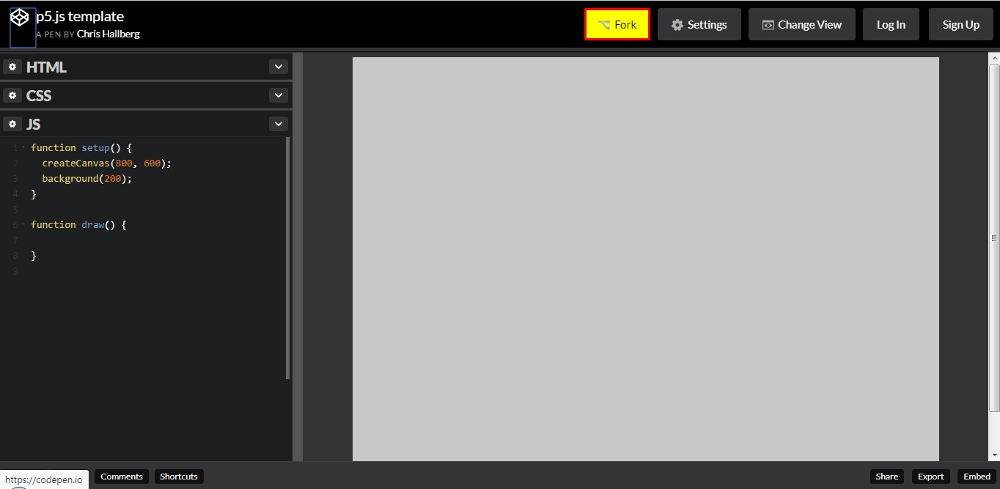
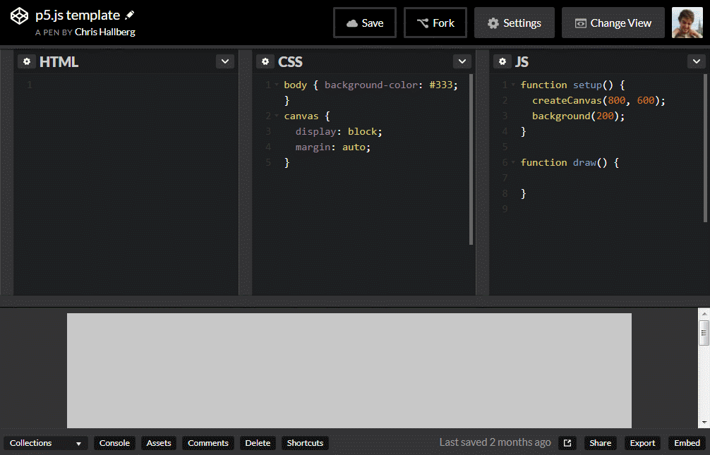

# 2 p5.js and Codepen

## 2.0 What is p5.js?

[p5.js](https://p5js.org/) is a Javascript library that makes coding graphical and interactive programs much easier. It is the Javascript version of a popular language called [Processing](https://processing.org/), which is the same thing but for Java. Both languages are created for artists and for learning and were created by a generous and diverse community dedicated to make coding more accessible and more fun.

A program in p5.js is usually called a "sketch" or (commonly) a "project".

## 2.1 What is Codepen?

[Codepen](https://codepen.io) is a code sandbox for web pages. It allows you write code in textboxes and see the updates to that code in real time on the same page. It's very powerful for small tests or really focused projects that don't require a lot of infrastructure (you could make a small game, but not Facebook with its databases).

## 2.2 How will I use them in this class?

On Codepen, there is a collection for this class: [https://codepen.io/collection/nmOqMy/](https://codepen.io/collection/nmOqMy/). In this collection, there is a template file for p5.js: [https://cdpn.io/e/ZyrdYG](https://codepen.io/crhallberg/pen/ZyrdYG). By **forking** this project, you will able to get up and running with a project very quickly.

# https://cdpn.io/e/ZyrdYG

All the code examples I create in class will be housed in the collection for reference any time in the future.



You can save anonymously, but I encourage you to [make a free account](https://codepen.io/accounts/signup) so that you can like the template and have all of your projects in one place.

## 2.3 The Project Skeleton

```JS
function setup() {
  createCanvas(800, 600);
  background(200);
}

function draw() {

}

```

The template I provide gives you everything you need to get up and running. p5.js requires a special Javascript file and relies on a particular code outline, so I've provided those for you.

### 2.3.1 setup() and draw()

These are the two crucial sections of any p5 project. We'll get more into functions later, but for now, understand these two parts as completely independent. Between the brackets of each is an isolated bubble of code called a **block**.

When you start a p5 project (which happens after any edits in Codepen), the **setup** block runs first. p5 runs the code in setup automatically and before anything else in your project.

After setup runs, the **draw** loop begins. The code in draw will repeat over and over again until the project is stopped or you tell it to stop. This allows you to create the illusion of movement, like a movie reel or a flipbook, which we'll get into next week.

### 2.3.2 `createCanvas(width, height)`

This is the only required line of code in any p5 project. This line of code creates the canvas onto which we paint everything visual. It also specifies the size of this canvas with two numbers: **width** (number of pixels wide) and **height** (number of pixels tall). You can use these words in your code to more easily access the width and height of your project.

### 2.3.3 `background(red, green, blue)`

The most basic command in p5. It fills the entire canvas with the specified color, covering everything drawn before it. Defining colors will be covered in the next section.


## 2.4 More on Codepen

### 2.4.1 Why is it called a "fork"?

Hitting the fork button makes a copy of the code. The word **fork** is borrowed from version control software (such as [git](https://git-scm.com/), which I highly recommend). The idea is that the original continues on with its edits and progress, while the copy progresses in a new direction, like a fork in the road. Hence the logo (see above).

### 2.4.2 Exporting Projects

For the larger projects, I'm going to ask you to export your Codepen code. In the bottom right of the Codepen window there is a tiny button labeled "Export". Select .zip, download, and upload to Canvas. I will remind you of this, don't worry.

### 2.4.3 The Codepen Layout

Below is a GIF of how to setup Codepen the way I have it and recommend it. You should only have to do this once.


