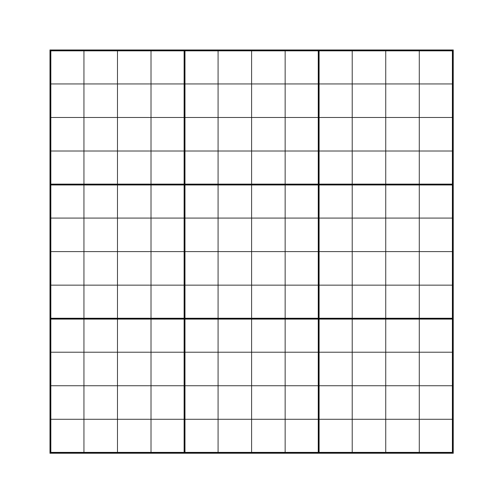
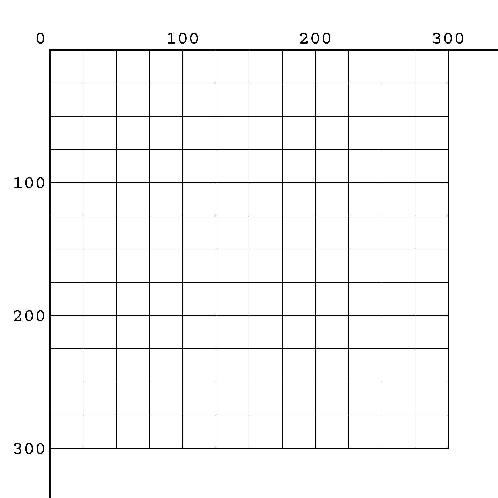

# 3 Basic Drawing

## 3.1 Drawing on a grid



This is the canvas, where would you imagine the origin to be? If I asked you to plot (0, 0) on this graph, where would you put it?

Let's break it down. This will feel familiar from algebra or calculus.

The X-axis the horizontal axis that goes left to right. The Y-axis is the vertical axis that goes up and down.

A **coordinate** a location on the grid as specified by pair of numbers: an X-value (distance along the X-axis away from the origin) and a Y-value.

The correct answer is that **the origin goes in the top left** corner in programming.



This is inverted from traditional math graphs, which has the origin in the *bottom* left so that the larger a value is, the higher it goes. It also goes against some creative environments that put the origin in the center.

One way you can think of the Y-axis in programming is as a submarine depth. The larger the Y value of a coordinate, the farther from the top it is. This has to do with the way computers store information and will be clearer when we talk about arrays later this semester.

For example, let's consider the coordinates (80, 150) and try to place this point on the grid. We would normally call 80 the **x-coordinate** since it specifies the horizontal position along the X-axis and 150 the **y-coordinate** since it specifies the same along the vertical Y-axis. The larger the x-coordinate, the farther left a point. The larger the y-coordinate, the farther down the canvas. In every coordinate pairing, **x is always first, followed by y**. This goes for all paired measurements in code (like width and height), they always go horizontal first, then vertical.

[!Picture of points]()

[Click here for answer]()

## 3.2 Shapes

### 3.2.1 Building a House

We're going to learn to draw four basic shapes: lines, rectangles, circles, and triangles.

> Using only these shapes, draw a house on the grid. Lining your points of up with the grid will make later steps easier.


### 3.2.2 Quanitifying shapes

The first thing we need to discuss is how to quantify these shapes. We need to break down these shapes into numbers that would allow anyone or any program to draw the same thing on the coordinates grid. For example, a line is defined by its two end points.

So we have four numbers that define a line: x and y of the start point and the x and y of the end point. These four numbers (two pairs of coordinates) define any straight line we can draw.


We use four numbers for rectangles as well. The numbers we use for a rectangle are the x and y of the top left corner and the width and height of the shape.


A circle (or ellipse) uses 4 numbers: the coordinates of the center, followed by the width and height (horizontal and vertical diameters). Any ellipse that has an identical width and height would be a circle, else we call it an ellipse (fancy oval).


A triangle uses 6 numbers: 3 pairs of coordinates for the 3 corners.


> Using these systems, write out the appropriate numbers for each shape in your house drawing.

```
```

### 3.2.3 Parameters

Now that we've come up with a system for how to define various shapes with numbers, we need to format that information in a way that is convenient for programming. The nearly universal format for this is **parameters**. Parameters are normally written out as numbers separated by commas and surrounded by parentheses. We would write a line's parameters out like this:

# `line(x of start, y of start, x of end, y of end)`

Remember that when we have coordinate pairs, we always put the horizontal value first.

> Re-write your house shape numbers into the proper parameter formats.

### 3.2.4 Your First Program

Now that we have the right information in the right format (hopefully), we just need to tell the computer to draw these shapes. This will be very straight forward, once we go over a few bits of vocabulary and caveat.

1. Every line of code you write is called a **statement**. The way a computer can tell where one statement ends and the next begins is with **semicolons (;)**, the same way you can tell where a sentence ends by the period.
1. Every time you draw a shape in p5.js, it will draw on top of what is already displayed, so pick the order of your statements carefully. For example, if you want your house to sit on a hill with a sky, you'll want to draw those (and any other background elements) first so your house can be in front of them. The doorknob should be drawn after the door, etc.
1. The statements we will be using to draw shapes are called **commands** because p5 already knows how to draw these shapes by name. Those commands are below!

```Javascript
line(x1, y1, x2, y2);
rect(x, y, width, height); // Programmers like abbreviations
ellipse(x, y, width, height);
triangle(x1, y1, x2, y2, x3, y3);
```

Just replace the labels with the numbers you want to use. We will be putting our commands into `draw()` since putting the shapes on the screen is not normally part of setting a program up, the way telling p5 how tall and wide to make your canvas does.

> Enter your house shape parameters into Codepen and see the magic happen! Tada! :tada:

Don't forget to fork the p5.js template before putting in your code!

## 3.3 Colors

### 3.3.1 Additive Color

Now that we have a house (hopefully), it's time to bring it to life. However, we are going to be using a color system that you're probably not used to. On the left below, we have the system you've likely been using your whole life, the **subtractive color system**, which models how paint, crayons, ink, and markers work. On the right is the **additive color system**, which is how we model the colors caused by light and therefore screens.

| | Subtractive Color | Additive Color |
|-|-------------------|----------------|
| Primary colors | red, yellow, blue | red, green, blue |
| The more color you add, the... | darker it gets | the brighter it gets |
| The sum of every color is | Black | White |
| Color wheel |  |  |

It's very strange and takes a little getting used to. To help you pick the right colors, searching "color picker" in either [Google](https://encrypted.google.com/search?hl=en&q=color%20picker) or [DuckDuckGo](https://duckduckgo.com/?q=color+picker&ia=answer) will bring up a tool you can use.

See the additive color system in action here: http://imgur.com/3Qnklmz.

### 3.3.2 Defining colors

Since p5 is drawing things on your screen, it needs information according to the additive color system. The most common way to do this is by telling p5 how much red, green, and blue to put into a color, in that order. Like so:

# `background(red, green, blue)`

These three numbers range from 0 to 255, least to most color. For example, a nice sky blue is (0, 150, 255). Putting 0 for red leaves out red all together. Setting green to 150 gives us about 2/3 of our full green capacity. Maxing out blue at 255 gives us all the blue the computer can muster.

If we added red to this, it would actually bring it closer to white for a while. You can see this by messing with the color picker. After around 80, the color starts to shift to purple. If we made all the numbers the same, we would get gray, since no one color is stronger than the others (all 0 for black, 255 for white).

### 3.3.3 Coloring shapes

p5.js has two colors it uses to color shapes. **fill** is the color used the color the inner area of a shape. **stroke** is used to color the outline of the shape. p5 can only know what color you want a shape to be if you set it beforehand. Think of how the paint bucket works in MSPaint or Photoshop.

You can set these values with the following commands.

```
fill(red, green, blue);
stroke(red, green, blue);
```

Or tell p5 not to draw the inner area or outline of a shape like so:

```
noFill();
noStroke();
```

When you set or unset a fill or stroke color, p5 will use that color until you change it. This also means that , because `draw()` repeats itself over and over, the last color set in draw will be the first one p5 tries to use on the next repeat.

> Try to color in your house using the fill, stroke, and background commands.

### 3.3.4 How Does It Work?

In reality, you're telling the computer how bright to make each of the subfilaments of each pixel, magnified below. This is what an iPad looks like very close up (and likely showing a while screen).


