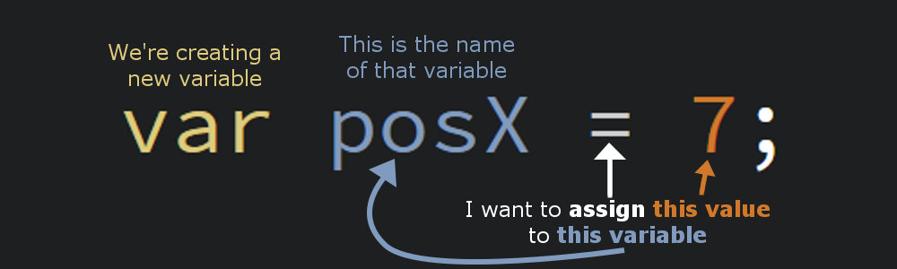

# 6 Variables

## 6.1 Numbers that Change

So far, we've been writing programs that do the same thing over and over again really fast. That's... cool... but that's not all computers are capable of. The magic really happens when your program changes and calculates and responds. That's why we need numbers that change: labels that connect to values that vary from cycle to cycle: **variables**.

We've already used a few variables that p5.js creates for us in the last section: `mouseX`, `mouseY`, `key`, `mouseIsPressed`. Now it's time to make our own.

## 6.2 Making Your Own Variables

The command to create a new variable looks like this:



The keyword `var` lets p5 know that we're about to create a new variable. After this, you give your variable a name (no spaces, must start with a letter). For tips on naming variables, see *Camel Case* below.

You can have just `var name;` if you're not sure what value you want to store in a variable.

### 6.2.1 Assignment

That gets us to the most important part of this statement: `=`. A single equals-sign is the **assigment operator**. You remember from our section on boolean operators that an operator is a symbol that does its thing when places between two values. In this case, those values are a variable on the left and the data you want to save in that variable on the right.

Looking at the image above, this statement would save the number 7 under the name posX. You can use a variable name in place of any number or value in your code. When you do so, p5 will use the value stored inside of it. So for example if you drew an oval like this: `ellipse(posX, 10, 3, 4);`, that oval would be centered on (7, 10).

Variables only change their value when you use the assigment operator. Using a variable inside of a math equation or as part of a comparison will not change the value of the variable. Only when it appears on the left side of an assignment operator.

## 6.3 Scoping

> This is going to get hairy, brace yourself.

All variables have a nemesis: closing braces (`}`). Programs want to run fast and if you have hundreds of variables, that can slow things down and take up a lot of memory. So most languages have a feature called **scoping**. A scope is a block of code and all the codes that contain it.

An easy way to picture it is with depth. Every time you pass an opening brace (`{`) and enter a new code block, you're going farther "down" into the scope. Every time you pass a closing brace (`}`) and reach the end of a code block, you go back "up" the code. Indenting helps visualize this.

```Javascript
var earth = 0; // This is the global scope: the top-most level. Variables made here are available to the entire program.

function setup() {
    var fromSetup = 7; // This variable is farther "down" because it's inside the setup() code block

    if (width > 1000) {
        var wideScreen = true; // This variable is even farther "down", notice the indenting.
        // The variable "earth" is "above" this block, so it can still be accessed. "fromSetup" is closer in scope.
    }

    // Now that we've left the code block "wideScreen" is in, that variable is "below" where we are, and is considered inaccessible.
}
```

Scoping has two main benefits:

1/ *Scoping keeps the most relevant variables close at hand for faster performance*. Closeness to a program is how many code blocks "above" the current code a variable was created. Scoping only looks "up" when looking for variables, never down.

2/ *Scoping deletes variables when they can no longer be reached*. This frees up memory and reduces the number of variables that need to be checked to find a matching name.

Closing braces (`}`) are a variable's nemesis because variables made inside the block being closed are going to be erased. In our example above, neither `fromSetup` nor `wideScreen` would be useable in the `draw()` function because the scope they were created in was closed, the variables created in `setup()` were erased, and `draw()` was created after.

## 6.4 Camel Case

There are only a few rules to naming variables:

1. They cannot contain spaces.
2. They cannot start with a number.

That's basically it for most programming languages, but the first rule creates a challenge. You want variable names to be descriptive. Ideally, they should be *self-describing*, meaning just reading the variable name tells you all you need to know about how that variable is used, without any comments. Using phrases allows you to express what a variable does much better, but "mouse is pressed" is not a valid name. How do you combine the words?

The most common convention is called "camel case". Camel case is when you put all the words together, make the first lowercase, and capitalize the rest of the words: `mouseIsPressed`, `positionOfTheRedBall`, `allWorkAndNoPlayMakesJackADullBoy`. p5.js uses this convention, so I encourage you to as well.

The other common convention is called "snake case", where you make everything lowercase and connect them with underscores: `mouse_is_pressed`, `position_of_the_red_ball`, `all_work_and_no_play_makes_jack_a_dull_boy`. This is common for languages like Python (lol) and C. Feel free to name your variables in this manner, but the ones from p5.js will always be camel case.
