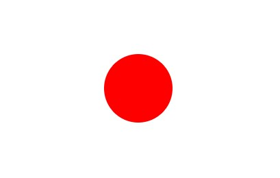
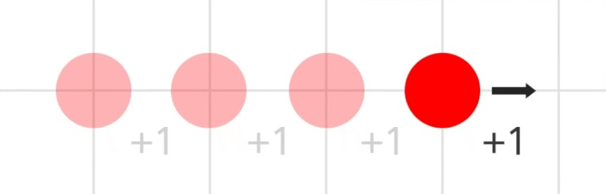
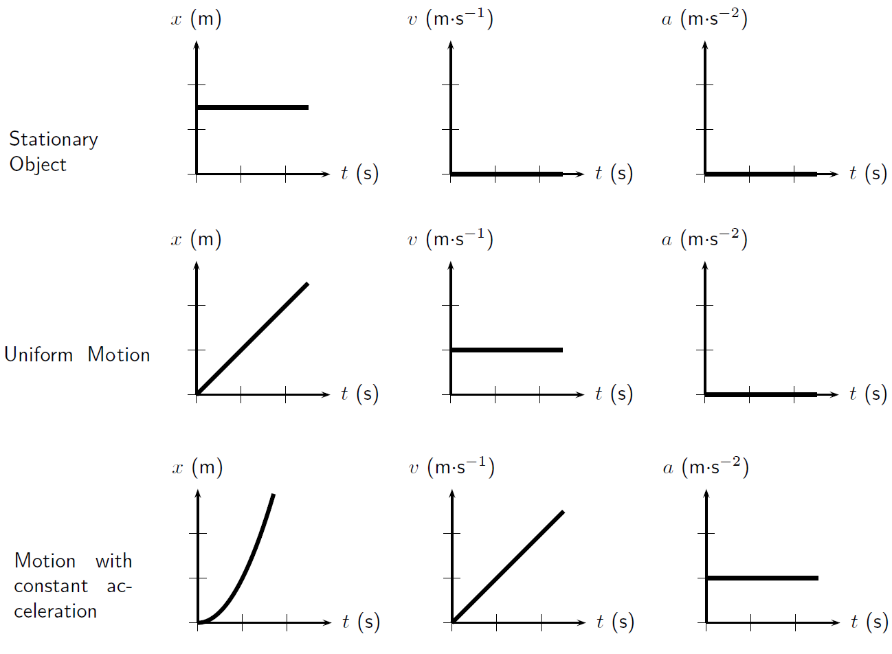

# 7. Making Things Move

## 7.1 The Draw Loop

You may be sick of hearing it by now, but the `draw()` function is repeated over and over and over again. This gives you the oppurtunity to create the illusion of movement, the way a film reel or flip book does. By slightly changing the image many times, very quickly, you can bring your sketches to life and simulate things like physics, motion, action, or intelligence.


Since p5.js is already doing the flipping of the pages for us, we just have to worry about the subtle changes.

## 7.2 Motion and Variables

So let's make a variable:

```Javascript
var position = 0;
```

Drawing a circle using `position` as it x position will result in drawing the same circle over and over again.

```Javascript
function draw() {
  ellipse(position, 0, 100, 100);
}
```



> wow.

But now, let's add a line to draw:

```Javascript
function draw() {
  ellipse(position, 0, 100, 100);

  position = position + 1;
}
```

Your code training so far will tell you that this line takes the value in `position` (starting with 0, as set above), adds 1 to it, and stores the sum back into `position`. When you [run the program](https://codepen.io/crhallberg/pen/eGmvag), you will see your circle slowly make a break for the right edge.



> It's alive!

When we add the same number to a position over and over, we create speed. You may remember this from physics class. Something about integrals. Don't worry, calculus is much easier when you can do it in many tiny steps.

## 7.3 Controlling Speed

Right now, our circle has a speed: a horizontal one that is hard-coded to a 1. ("hard-coded" meaning using the actual value in the code as opposed to a variable. If done a lot, it can make updating or fixing programs more difficult.)

We're going to take control by making speed a variable.

```Javascript
var position = 0;
var speed = 1;

 // ...

  position = position + speed;
}
```

Now we're going to make the sketch more interactive by using the mouse to control the speed of the ball. The way I want to have is so that the farther left you move the mouse, the faster the ball goes left, and vice versa. This is easily done using `map()`:

```Javascript
speed = map(mouseX, 0, width, -3, 3);
```

### 7.3.1 A Brief Map Review

I'm mapping the mouse position, so `mouseX` is the first parameter.

When the mouse is *all* the way to the left (position 0) I want the ball to be cruising at 3 pixels per frame, so `0` and `-3` take the two minimum positions. Negative because we're moving left.

The maximum mouse position is at `width` and the fastest right I want the ball to go is 3px/f, so `width` and `3` take the two maximum positions.

## 7.4 Acceleration

We can take this a step further. Just as a variable that controls position is speed, a variable that controls speed is acceleration. This can allow for really smooth motion, and is most often used to create gravity.

[Here's an example](https://codepen.io/crhallberg/pen/jGEmJL) that expands on the previous example by adding gravity, using the following steps:

1. Add three variables for vertical position, speed, and acceleration (gravity).
1. Use the position variable in the ellipse command.
1. Every draw, add speed to position.
1. Every draw, add gravity to speed.
1. If we hit the bottom of the screen, invert speed to simulate a bounce.

It's pretty fun.

## PS. Visualizing the Three Movement Values

The graphs at the bottom of this page may seem complex, but it'll make sense as you play around with motion in programming. Just bookmark it for later.


