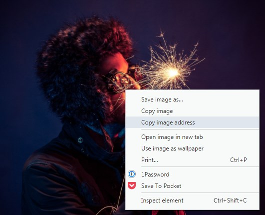
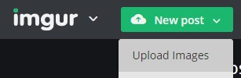
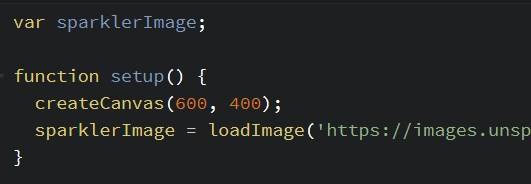

# 9. Images

## 9.1 Loading Images

To use images in p5.js, we need to **load** them first, then we can display them.

Normally, you can put images in the same folder as your code, but since we're coding in Codepen, we'll need to load images off the internet. You'll need to find an image an copy its URL. Keep in mind usage rights, there's a setting for that in Google Image Search. You can also use a site like [Unsplash](https://unsplash.com) which has open usage for all of its images.

If you have an image you want to use on your computer, you can upload it to a hosting site like [Imgur](https://imgur.com).

> You don't have to login or publish to the community to host an image.

After this, you need to use the command [`loadImage`](https://p5js.org/reference/#/p5/loadImage) to save the image into a variable. Since we want to do this once and before we draw anything, we should do this in setup. Here you can see that we put the URL in between quotes. Single quotes (') or double quotes (") will both work.

> If you're loading huge images and having some problems, try using [preload()](https://p5js.org/reference/#/p5/preload).

## 9.2 Drawing Images

Now that our image is saved to a variable, we can draw an image in nearly the same way as a rectangle:

### `image(imageVariable, x, y, width, height);`

Not specifying a width and height will cause the image to draw at full size, which may be far too big for your sketch.

## 9.3 The Image Object

Loading an image in p5 gives you access to a [whole bunch of information](https://p5js.org/reference/#/p5.Image) about the image. As an example, [here's some code](https://codepen.io/crhallberg/pen/PJbdYX) that will change the background of the sketch to equal the color of the pixel the mouse is over. It uses [image.get](https://p5js.org/reference/#/p5.Image/get) and an image's width and height properties.
