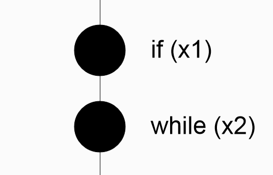
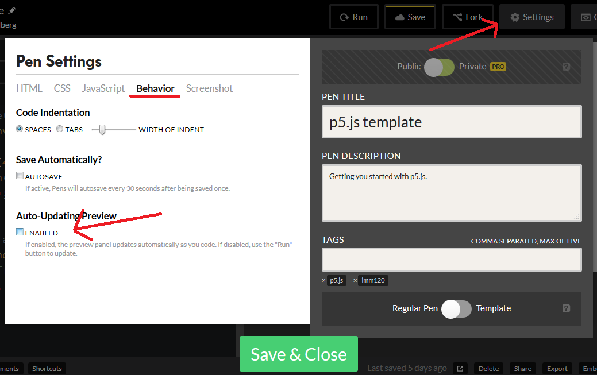
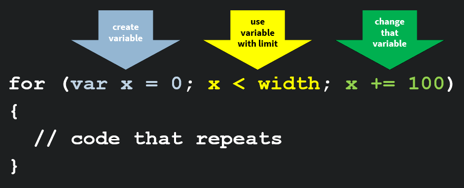

# Loops

Congratulations! At this point we've covered the basics of drawing and data. The next giant step up is to prepare you to handle lots of data. Face it, if you wanted to take any part of your programs up to this point and added many more of it, it would be a lot of work.


> Imagine making this piece of art: Sol's Wall Drawing #86.

Luckily, there are many good ways to handle lots of data and I'm going to walk you through them. The Trifeca of Tons of Data is **loops, arrays, and objects**. We'll cover loops now and you can handle arrays (lists) and objects in the next few chapters.

## Repeating Code

What loops are good for are repeating the same pieces of code over and over again. We've already had some experience with this using the `draw()` loop which repeats all of its code around 60 times per second. 60 times a second seems really fast, but if we wanted to draw ten thousand lines (for Sol's Wall Drawing #86 for example) it would take a long time. Almost 3 minutes, in fact. We can do all of that in a fraction of a second with loops.

## The `while` Loop

Let's take a look at some code:

```JS
var x1 = 0;
var x2 = 0;
// setup, etc
function draw() {
  if (x1 < 100) {
    x1 += 1;
  }
  while (x2 < 100) {
    x2 += 1;
  } // closing bracket
}
```

Here you can see our new control structure: `while`. A quick review of if-statements: they check the conditional between its parentheses, if that conditional is true, it performs the code inside its brackets. If the conditional is false, it skips to the first line after its closing bracket.

While-loops have the same syntax as an if-statement, with one important difference: if its condition is true, it runs the code between the brackets, but *when it reaches its closing bracket, it repeats*. This means it checks it condition *again* and if it's *still* true, it runs the code between its brackets again.

Running the code above results in the following:



You'll see that the circle using the if-statment for its position (x1) moves ahead 1 pixel every loop and the circle using the while-loop for its position (x2) is waiting at the end. This is because the while-loop did all of its updating within one draw loop. The if-statement added 1 and moved on, but the while-loop repeated itself 100 times until x2 was 100 (not less than 100).

## Creating A Pattern With Loops

To properly utilize a loop, we need to create a variable that will change in a way that will eventually stop the loop. You'll want to set the variable to a useful starting point and the conditional in the while-statement to be a good ending point. For example, let's draw some vertical lines from 100 to 300 in our sketch window.


> From here to here

So let's start at 100:

```JS
var x = 100;
```

We need to make sure we don't go any higher than 300, so let's set our conditional there:

```JS
while (x <= 300) {
  // code
}
```

And finally, we want to change `x` for two reason: 1/ to space out our lines, 2/ to make sure our loop doesn't repeat forever (see Infinite Loops below). What we change `x` by is the distance between our lines.

[All together](https://codepen.io/crhallberg/pen/jadZqd):

```JS
var x = 100;
while (x <= 300) {
  line (x, 50, x, 300);
  x += 10; // 10 pixels apart. Smaller distances, more lines.
}
```

## Infinite Loops

If the conditional within a while-statement never becomes false, you'll have something called an "infinite loop", where the code will never advance past the loop. That's not good. Except in very controlled cases, this will freeze up your entire code. If you're using Codepen, you'll want to turn the Auto-Updating Preview setting off, so you can write and check your loops without your code running before you can finish.



## Unrolling Loops

One way to double-check your loops and understand what's going on under the hood is to take the loop and unravel it step-by-step. When you do this with code, it's often called "unrolling" your loops.

Let's take our line loop for example. We start with `x = 100`, so that would be our first line:

```JS
line (100, 50, 100, 300);
```

After this we add 10 to x: `x = 110`. Since 110 is less than 300, we draw our next line:

```JS
line (100, 50, 100, 300);
line (110, 50, 110, 300);
```

Add 10, 120 is less than 300:

```JS
line (100, 50, 100, 300);
line (110, 50, 110, 300);
line (120, 50, 120, 300);
```

This goes on for a while, so let's cut to the next interesting part, our line at 290:

```JS
line (100, 50, 100, 300);
line (110, 50, 110, 300);
line (120, 50, 120, 300);
// ...
line (290, 50, 290, 300);
```

290 + 10 == 300, which is equal to 300. Since we're checking `x <= 300`, we draw one last line:

```JS
line (100, 50, 100, 300);
line (110, 50, 110, 300);
line (120, 50, 120, 300);
// ...
line (290, 50, 290, 300);
line (300, 50, 300, 300);
```

At the end of this pass, `x = 310` which is *not* less than or equal to 300, we exit the loop and continue with the rest of the code. We drew a total of 20 lines.

*On the other hand*, if you ever see a pattern like this in your code, it may be a good opportunity to "roll" your code into a loop. This will save you a headache if, for example, you wanted to make all your lines longer, or you want twice as many:

```JS
  x += 5;
}
```

## A Counting Loop

A very common pattern that uses the while-loop is something we're going to call a "counting loop". This is a useful pattern if you want a loop to repeat code a specified number of times.

```JS
var count = 0; // start at 0
while (count < 10) { // end at 9 (10 times including 0)
  // code you want to repeats
  count += 1; // don't forget this or your loop will never stop repeating (an infinite loop)
}
```

If you wanted to repeat the pattern above, you can multiply the count variable by the gap you want between the lines.

```JS
var count = 0; // start at 0
while (count < 10) { // end at 9 (10 times including 0)
  var x = 100 + count * 10; // start at 100, 20 pixels between lines
  line (x, 50, x, 300);
  count += 1; // don't forget this or your loop will never stop repeating (an infinite loop)
}
```

## The For-Loop

If you want to use the patterns above, there is a more concise way to combine all three common features:

1. Make a variable that starts where you want.
1. A conditional that is true until your desired end point.
1. Change the variable to keep the loop going, then ending.

It's called a for-loop:



Our lines above would look like this:

```JS
for (var x = 100; x <= 300; x += 10) {
  line (x, 50, x, 300)
}
```
