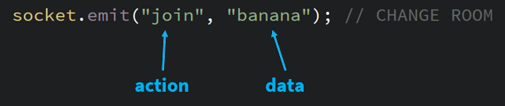

# Sockets

Sockets allow a computer to connect with other computers running the same program, sending data back and forth in real-time. Normally, servers only send information to a browser or a project in response to a request. Opening a socket creates a connection where information can be sent from either end at any time. This gives us many advantages over call-and-response.

All of this is powered by a library called [socket.io](https://socket.io/), which as far as I'm concerned is *magic*.

## The Server

The first thing you need to run is a server. In this folder is included [code](./server/imm120.js) for a simple [Node](https://nodejs.org/en/about/) server, which should be easy to run and easy to use. All of the code here works with this server, but the patterns I'm using here should be fairly common.

## The Client

A "client" is anything that displays info sent from the server. A client-server pair is the most common relationship. In this case, we're going to have many clients sending information to each other through a server.

The first thing we need to do is **connect to the server**.

```JS
var socket = io("//server.com:port");
```

When [our specific server](./server/imm120.js) receives a new connection, it adds it a shared room called "imm120". Rooms work like a chatroom in any chat program. You can send a message to any specific room and it'll go to everyone in that room and only that room. The difference here is that the server will also send a message to you, since you're in the room.

Since you're now in the default room, the second thing you'll want to do is **change your room**. The action for our server is called "join".

```JS
socket.emit("join", "my-awesome-room");
```

## Emit and On

`.emit` here is sending a message to the server. These messages contain two parts: **the action and the data**.



The server will then take your action and data and send it to every other client that has joined the same room as you. Actions help you keep your messages for different things in your program separated. For example, if our program was a chat room, you'd want a different action for changing your name, sending a message, and sending a picture.

On the other side of an emit, you'll want to be listening for those actions so that you can react to the data properly. Here's an example "listener" waiting for an action called "trail".

```JS
/* Data looks like:
{
  "color": { color },
  "path" : { array of points },
}
*/
socket.on("trail", function (data) {
  console.log("trail", data); // print out the data to the console
  strokeWeight(3);
  stroke(palette[data.color]); // set the stroke color to the color in the data
  drawPath(data.path); // draw a line connecting all the points
});
```

The combination of clients using `.emit` and clients listening for messages with `.on` allows a large number of programs to interact in real-time via the Internet. Run this program to enjoy!

## Things to Consider

There's a few tricky bits to using sockets, in particular with every message you send also being received. There's a simple but pervasive way around that.

### Unique IDs

By using a unique ID at the start of your program, you can eliminate received messages that you sent yourself (if you want to). You can see the [Pong](./pong) example for some code that does this.

```JS
var socketID = Math.random(); // sets id to a long random decimal

// Sending messages
socket.emit("move", {
  id: socketID, // include this with every message
  x: mouseX,
  y: mouseY,
});

// Receiving messages
socket.on("move", function (data) {
  if (data.id === socketID) {
    return;
  }
  // Handle the data normally
}
