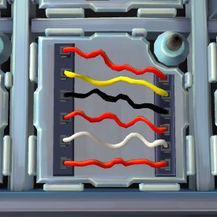
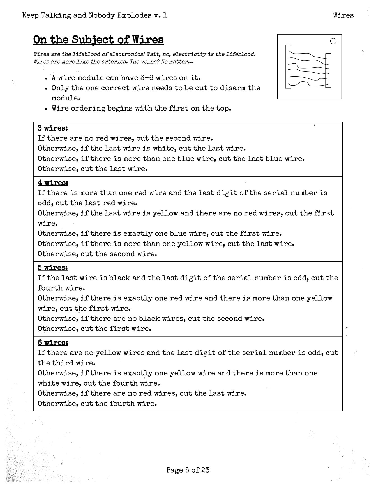
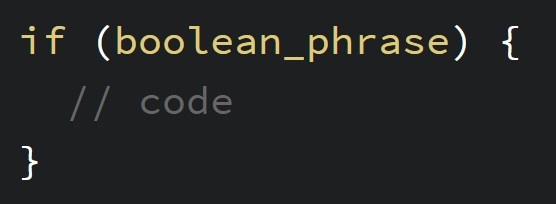
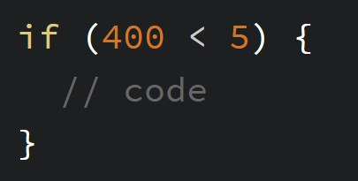

# 4 Conditionals

## 4.1 Defusing Bombs

You are confronted with a bomb! In order to defuse the bomb, you need to cut the right wire to disarm the bomb. Which wire do you cut?

| Bomb Panel | Bomb Defusing Manual |
|------------|----------------------|
|  |  |

Which wire did you cut? [Was it this one?](bombcut.jpg) If so, congratulations!

These examples are from the exceptional [Keep Talking and Nobody Explodes](http://www.keeptalkinggame.com/), but today we're more interested in the manual. **How did you figure out which wire to cut?**

## 4.2 The English Language

The wires section of the manual is divided into sections and statements. In the statements, there are a lot of sentences that start with **"if"**. In English, we understand that an if phrase is followed by an idea that is only true or an action that is done when the if phrase is accurate.

> "If you see a bear, **run**!"

> "If you're going to be late, give me a call."

We even have a few phrases for what to do when the if phrase is not true. You can even have someone do one thing if it's true and another if it's false: the Bomb Manual above uses the word "otherwise" to do this to great effect.

> "If there's an orange soda, I'll take that. If not, I'll have a cola."

> "If you can't make it, that's fine."

These phrases and structures are called **conditionals**: what happens depends on where or not a certain condition phrase is true.

## 4.3 Conditionals in programming

**if** is one of the most common words you'll see in programming, because it starts a conditional statement. This is called an **if-statement**.



There are three parts here:
 - The Keyword: if
 - The Code Block: between the brackets { }
 - The Boolean Phrase: a code structure that is either *true* or *false*

Just like we needed to give our shapes information, you need to give if information. Only one piece of information this time: a boolean phrase. A boolean phrase is always either true or false, never anything else (that's what boolean means). If the boolean phrase is true, the code block between the brackets will run. If not, your program will skip to the closing bracket (}) without running the code.

## 4.4 Boolean Phrases

So how do we create these true-false ultimating statements? We do that by comparing things. Nearly every question comparing one object directly to another has a `true` (yes) or `false` (no) answer.

> Is the moon larger than the Earth. No.

> Does one pound of feathers weigh the same as one pound of lead? Yes.

> Is chocolate better than vanilla? No.

We need to translate these comparisons into code, so let me introduce you to the 5 basic boolean operators:

| &gt; | Greater than |
| &lt; | Less than    |
| ==   | Equal to     |
| !=   | Not equal to |
| !()  | Not |

*We also have greater than or equal to (&gt;=) and less than or equal to (&lt;=) if you're feeling adventurous.*

You can create a boolean phrase with these operators by putting a value on either side of them:

```Javascript
5 > 3    // true
0 < 10   // true
14 == 14 // true
14 != 14 // false
```

Putting a boolean value-operator-value phrase into an if-statement's parentheses brings the conditional to life. Or not, depending on its overall value (whether it *resolves* to true or false).



This code will never run, because 400 will always be larger than 5. Which means that a program with numbers like this in it would always do the same thing, over and over, really fast! That doesn't sound very useful (or fun).

We need something to solve this "issue"...

### 4.4.1 ! (The Not Operator)

The Not operator is particularly interesting. It can take any boolean phrase and invert it value. For example, `4 < 5` is true. However, `!(4 < 5)` will return false. The Not operator takes what you give it and returns the opposite.

This is a powerful and simple way to make more complex statements and is particularly useful with input booleans, which we'll cover in Section 5.

## 4.5 Numbers That Change

It makes perfect sense for values with in a program to change and evolve as it goes on. Because the value of these numbers change, we call them **variables**. Since we're allowed to label these fickle creatures in our code, variables look like a simple word or two, pressed together. The easiest place to find them in p5.js is in the mouse input.

`mouseX` and `mouseY` are two variables that p5.js creates and updates for you. We'll get into making your own variables later. Every time you use the variable name `mouseX` in your program, p5.js will replace it with the current value attributed to that label. For `mouseX`, that value is the number of pixels between the mouse pointer and the left edge of the canvas. p5.js will update it every time draw is run, so your code should always be able to keep up with the user.

Play around with [this simple sketch](https://codepen.io/crhallberg/pen/ZJgbqp) to experience the magic of changing numbers and conditionals!

> Change the position where the color change happens. See if you can put it in the middle. See if you can make the project always green or always purple.

> Try to add a horizontal line that always stays with the mouse, kind of like a crosshair.

> Add a third position that makes the background orange.

You'll find more options for simple fun inside of Section 5 - Variables.

## 4.3.2 if-else

One more thing before you go. If you want to make if, otherwise style statements, there's a word for that: **else**. The syntax is a little odd, but it allows you to run code when an if-statement is false. This is nice for concise and organized code, and can prove useful when making more complex things.

```Javascript
if (800 > 16) {
  // this code runs
} else {
  // this code doesn't
}

if (4 > 5) {
  // this code won't run
} else {
  // this code will do its thing
}
```
