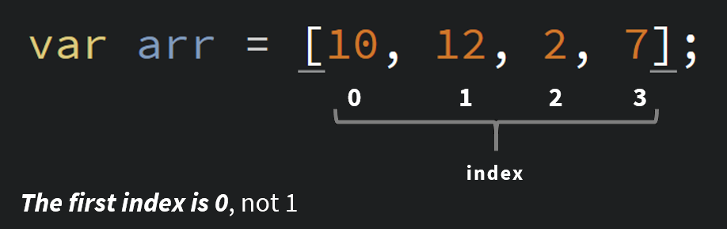

# Arrays (Lists)

Part 2 of our "handing lots of data special" deals with saving an arbitrary or dynamic amount of data without needing to make a new variable for each. Arrays allow us to store many values inside of a single variable. You can think of them as lists.

Instead of having a separate variable for each value:

```JS
var primeOne = 2;
var primeTwo = 3;
var primeThree = 5;
```

It doesn't really work, especially for adding or removing values. It's a lot of repeated code. This is way better:

```JS
var primes = [2, 3, 5, 7, 11, 13, 17];
```

The square brackets ([]) tell Javascript that we want an array and there's a comma between each value. It's really that simple!

## Using Arrays

There is the small matter of how we tell Javascript which value we want. Using `primes` on its own will give us the entire array. We can use the same square brackets for getting information out of and into an array.

Every position in an array has an address, which is called an **index**.



By using these indeces, we can pick out which values we want to read or change.

```JS
var primes = [2, 3, 5, 7, 11, 13, 17];
//            0  1  2  3  4   5   6

primes[0] // first position: 2
primes[4] // fifth position: 11
```

The same thing works with writing to an array:

```JS
primes[1] = 100;

primes // now equals 2, 100, 5, 7, 11, 13, 17
```

## Building Arrays

Besides writing arrays out by hand as above, we can build them with code. First, we need to make an empty array.

```JS
var squareNumbers = []; // put nothing between the brackets to make an empty array
```

Now we can use a loop to put as many items into our array that we want.

```JS
var index = 1;
while (index < 100) { // let's do 100 (<= because we're starting at 1)
  squareNumbers[index] = index * index;
  index += 1;
}
```
We can double-check that we filled the array using on of the array's properties: `.length`.

```JS
alert(squareNumbers.length);
```

This will create a pop-up with how many items are in our list of squares. The answer won't be surprising.

Another interesting thing about arrays and lengths is that the last index in an array is equal to its length minus 1.

```JS
var primes = [2, 3, 5, 7, 11, 13, 17];
//            0  1  2  3  4   5   6    <- primes has 7 items, last spot is 6.
```

```JS
alert(squareNumbers[squareNumbers.length - 1]);
```

[See it in action](https://codepen.io/crhallberg/pen/LOqQaO?editors=0010).
