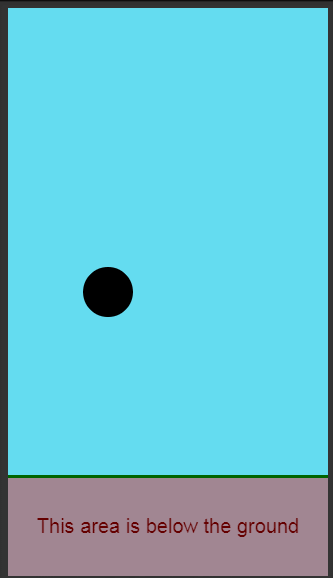
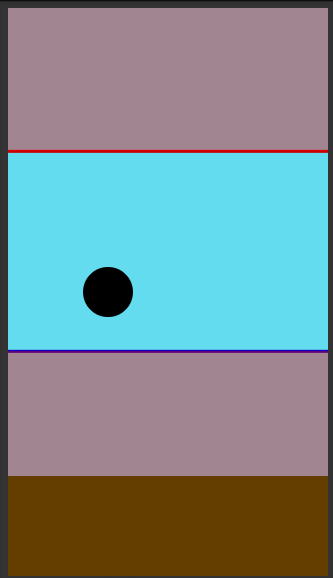
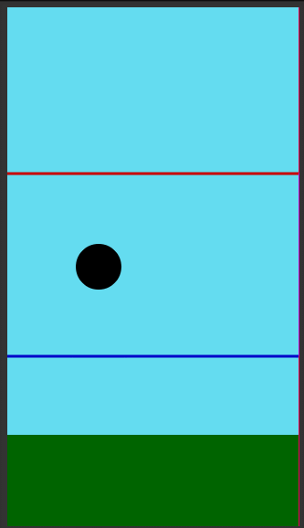
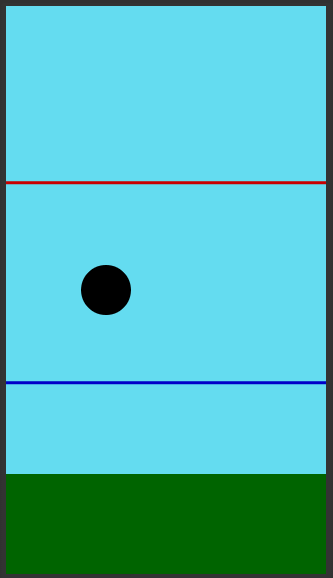

# Making Flappy Bird


## Setup

Only thing we have to concern ourselves with is the size of the canvas. Since this is a mobile game, we'll go with the resolution of the iPhone 6:

```Javascript
function setup() {
  createCanvas(375, 667); // iPhone 6 size
}

function draw() {
}
```

## Controls

Flappy Bird is an infamous mobile game and its deceptively simple controls are the core of the game. Let's take a closer look at the gif above. It looks like our little bird is going up and down, but not left and right. If you hold your finger between the bird and the left edge you can really see this. So we don't need to worry about any horizontal movement.

In short, we'll need 4 variables (right at the top):

```Javascript
var birdY; // our bird's vertical position, we'll assign this in setup
var speedY = 0;  // how fast we're falling, not at all at first
var gravity = .5; // the strength of gravity, higher means less time to react
var jumpStrength = 6; // the speed we set when we jump, guess and check until it feels right

function setup() {
  createCanvas(375, 667); // iPhone 6 size

  birdY = height/2; // height has been set, so we can use it now
}
```

We're going to wire this up in the usual way: draw shape, add speed to position, add gravity to speed.

```Javascript
ellipse(100, y, 50);

birdY = birdY + speedY;
speedY = speedY + gravity;
```

Now we need to add our controls. We'll do touch controls later, but for now we'll be using the mouse.

```Javascript
function keyPressed() {
  speedY = -jumpStrength; // negative so we go up
}
```

## Loop Control

I think you'll be surprised at how it looks when you [put it all together](https://codepen.io/crhallberg/pen/VMYWqP), even just these 22 lines of code. I think you'll also be surprised how hard this game is to get started. It's a bit of a contortion act to type code, click on the canvas when it updates, and press keys before our bird is gone. There's a simple solution for that:

At the bottom of `setup()`, add `noLoop();`.

At the top of `keyPressed()`, add `loop();`.

That's it! Now [the sketch](https://codepen.io/crhallberg/pen/YrPQBZ) will wait until you jump to get started! Easy!

### A Brief Word

Now that you have a working skeleton for the project, I'm more going to guide you through the process and the reasoning rather than spell out the code. I'll link to examples along the way, but I'm going to encourage you to try to implement these steps on your own before seeing how I did it. It all depends on how you learn, of course, do what is best for you.

## Hitting the World

For simplicity, we will be using the center of our bird-circle for all of our collision. You can absolutely factor in the width of the circle into collisions, but for conciseness and clarity we'll just be using the circle's center. So what we want to do here is detect if the center of the circle is below the ground.

1. Add a ground rectangle
1. In draw detect when our bird hits the ground
1. When it does, let's set `birdY` to half way down the screen and run `noLoop()` again. Let's call this ***reset***.



## Between the Lines

The goal of Flappy Bird is to keep the bird from hitting pipes by flying between them. Let's just start by flying at the right height, between two lines.

1. Make a variable for the top line, set it to a random number that's not too low.
1. Make a variable for the bottom line, set it to your top line plus a good gap, so we always have the same size window.
1. Draw the two lines horizontally.
1. If we fly above the top line, *reset*.
1. If we fall below the bottom line, *reset*.



> Don't go into the red

### `return;`

So, you may have noticed that when you reset, sometimes weird things happen, namely that your code seems to continue running. You can fix this by adding a `return;` into your code. Putting this in draw prevents any code after `return;` to run until the next time draw loops.

```Javascript
// Reset
birdY = height / 2;
speedY = 0;
noLoop();
return;
```

You can also used `redraw()` to run draw once. Especially useful when `noLoop()` is activated.

## The Approaching Pipe

The pipes, of course, aren't always there to dodge, they approach from the right. Let's add this in.

1. Make a new variable for the x position of the approaching pipe, starting all the way to the right (`width`).
1. Draw the line vertically.
1. Subtract 1 from the pipe's position each frame to make it come left.
1. Only do the check for the top and bottom lines if the bird is to the right of this approaching line.

With these three pipe checks and the ground check, we're now checking the following:



Getting pretty dangerous!

### A Pause for Functions

So, now we have the *reset* code in a few different places: setup, if we go too high, if we go too low, if we hit the ground.

That's a lot of code to copy over and over. What if you have to change how the game resets? We should put the pipe all the way back to the right for example. What about when we add a score?

Just like we gave the changing value for the bird's position the label `birdY`, we can give a block of code a label too. You can see three such labels in the code right now:

```
function setup() {

function draw() {

function keyPressed() {
```

It's time to make our own **function**, with a clear label (your variable names might be different, that's fine):

```Javascript
function reset() {
  birdY = height / 2;
  noLoop();
}
```

Now we need to replace those various pieces of code with a **call** to this function, using the name as a command and passing any needed parameters (which we'll get to later):

```Javascript
if (birdY > groundY) {
  reset()
  // used to say
  // birdY = height / 2;
  // noLoop();
  // it does this in the function now!
}
```

This is good, because we need to reset the approaching pipe:

1. Inside of our new `reset()` function, add a line of code to put the approaching vertical line all the way to the right again.



Great!

## The Back of the Pipe

Right now, we're playing Flappy Spelunking: it's like we're flying into a cave rather than between pipes with width.

1. Make a new variable for the width of the pipe.
1. Add to our approaching pipe check to make sure we're to the left of our pipe plus its width.

### Boolean Sentences

So that last bit is going the be tricky unless we learn something new: combining boolean phrases. The sentence we're trying to turn into a boolean is:

> if we're to the right of the approaching pipe and to the left of the pipe plus its width

We can do most of this:

- *We're to the right of the approaching pipe*: we're > pipe
- *pipe plus its width*: pipe + pipeWidth
- *to the left of the pipe plus*: we're < pipe + pipeWidth

But what about **and**?? We have a code equivilant for that: `&&`. This is a boolean AND, and it allows us to combine two phrases. In the case of AND, the whole "sentence" is true is only true if *both* parts are true. AND can only support two phrases at a time:

| "Sentence" | Resolves to | "Sentence" Result |
|------------|-------------|-------------------|
| `4 < 5 && 10 > 6` | `true and true` | `true` |
| `4 < 5 && 10 > 60` | `true and false` | `false` |
| `14 < 5 && 10 > 6` | `false and true` | `false` |
| `40 < 5 && 10 > 16` | `false and false` | `false` |

So let's use this to construct our pipe check. You probably have something like:

```Javascript
if (birdX > pipePosition) { // right of the vertical pipe line
  // ... top and bottom checks
}
```

And we add and:

```Javascript
if (birdX > pipePosition && birdX < pipePosition + pipeWidth) { // right of the vertical pipe line AND left of the pipe plus its width
  // ... top and bottom checks
}
```

## Reset the Pipe

So if we clear the pipe, we need to make a new one (only one at a time for now):

1. If the pipe plus its width is off the left side of the screen, reset the position to the right side.
1. Pick a new top and bottom line value.

## Finally, Keep Score

1. Make a variable to keep track of the score.
1. Every time we pass the right side of the pipe, add 1 to the score.
1. Every time we reset, set score back to 0.
