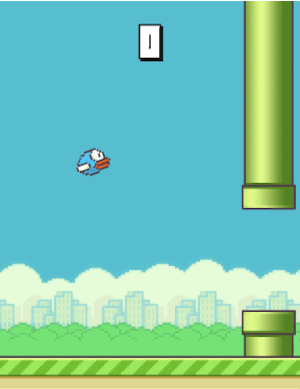

# Making Flappy Bird



## Setup

Only thing we have to concern ourselves with is the size of the canvas. Since this is a mobile game, we'll go with the resolution of the iPhone 6:

```Javascript
function setup() {
  createCanvas(375, 667); // iPhone 6 size
}

function draw() {
}
```

## Controls

Flappy Bird is an infamous mobile game and its deceptively simple controls are the core of the game. Let's take a closer look at the gif above. It looks like our little bird is going up and down, but not left and right. If you hold your finger between the bird and the left edge you can really see this. So we don't need to worry about any horizontal movement.

In short, we'll need 4 variables (right at the top):

```Javascript
var y; // our bird's vertical position, we'll assign this in setup
var speedY = 0;  // how fast we're falling, not at all at first
var gravity = .5; // the strength of gravity, higher means less time to react
var jumpStrength = 6; // the speed we set when we jump, guess and check until it feels right

function setup() {
  createCanvas(375, 667); // iPhone 6 size

  y = height/2; // height has been set, so we can use it now
}
```

We're going to wire this up in the usual way: draw shape, add speed to position, add gravity to speed.

```Javascript
ellipse(100, y, 50);

y = y + speedY;
speedY = speedY + gravity;
```

Now we need to add our controls. We'll do touch controls later, but for now we'll be using the mouse.

```Javascript
function keyPressed() {
  speedY = -jumpStrength; // negative so we go up
}
```

## Loop Control

I think you'll be surprised at how it looks when you [put it all together](https://codepen.io/crhallberg/pen/VMYWqP), even just these 22 lines of code. I think you'll also be surprised how hard this game is to get started. It's a bit of a contortion act to type code, click on the canvas when it updates, and press keys before our bird is gone. There's a simple solution for that:

At the bottom of `setup()`, add `noLoop();`.

At the top of `keyPressed()`, add `loop();`.

That's it! Now [the sketch](https://codepen.io/crhallberg/pen/YrPQBZ) will wait until you jump to get started! Easy!

## Hitting the World

Now that you have a working skeleton for the project, I'm more going to guide you through the process and the reasoning rather than spell out the code. I'll link to examples along the way, but I'm going to encourage you to 
